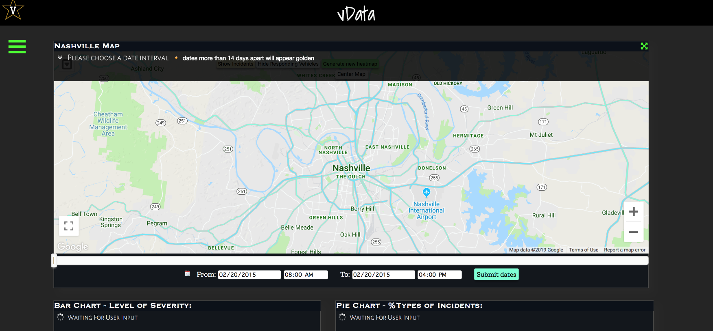

NFD DASHBOARD TOOL USAGE GUIDE

Note - This document is intended as a guide for the end-user, and not a
technical guide to the setup or the algorithmic background for the tool.
In case you have issues, please contact the team at Vanderbilt for help.

Development Team:

Faculty Members --

1.  Abhishek Dubey

2.  Yevgeniy Vorobeychik

3.  Gautam Biswas

Students --

1.  Zilin Wang

2.  Ayan Mukhopadhyay

3.  Geoffrey Pettet

4.  Fangzhou Sun

Table of Contents {#table-of-contents .TOCHeading}
=================

[Modes 4](#modes)

[Background Jobs 4](#background-jobs)

[Modes - description 5](#modes---description)

[Historical Mode 5](#historical-mode)

[Prediction Mode 7](#prediction-mode)

[Explore Mode 8](#explore-mode)

[Dispatch Mode 10](#dispatch-mode)

[Background Jobs - description 12](#background-jobs---description)

[Data Ingestion 12](#data-ingestion)

[Prediction Model Upgrade 12](#prediction-model-upgrade)

[Overall Monitoring 13](#overall-monitoring)

The NFD Dashboard tool is a means to visualize historical data,
summarize statistics from data, predict future incidents, explore the
impact of adding fire stations on response times and get real-time
guidance on dispatch decisions. This document is a one-stop guide for
the entire tool, and is meant to be used by the end user.

Modes
=====

The tool has four basic modes, with the following capabilities --

-   Historical -- The mode enables user to visualize historical data as
    heat map/ incident scatter plots on a geographical map of Nashville.

-   Prediction -- Enables the user to predict incidents for arbitrary
    future dates according the incident type.

-   Explore -- Lets the user add a new fire station,

-   Recommend -- Lets the user calculate a new station's effect on the
    response time.

-   Dispatch -- Helps the user in plotting pending incidents that need
    to be serviced, and provides a recommended dispatch decision.

Background Jobs
===============

The tool has three primary background jobs -- data ingestion to the
mongoDB used by the dashboard, upgrade of the prediction algorithm with
streaming data and overall monitoring of the tool. We discuss the modes
as well as the jobs individually in this document.

Modes - description 
====================

Historical Mode
---------------



The tool starts with the home screen shown in Fig. 1, waiting for the
user input. To work with the historical mode, one should --

-   Select a date range using the date slider/calendar input box (the
    tool populates the earliest and latest dates available for selection
    by itself, based on the available data).

-   Date ranges less than or equal to 14 days show individual incidents
    (Fig. 3). To avoid cluttering the map, date ranges greater than this
    are shown as heat maps (Fig. 2).

-   Upon selecting the date range, the user should click the submit
    button, which loads the map and the statistics (Fig. 4), as shown in
    the figures below.

    {width="4.625694444444444in"
    height="2.1840277777777777in"}

{width="4.804841426071741in"
height="2.363888888888889in"}

Figure : Incident Map (Date Range \<= 14 days)

Given a date range less than 14 days, the user can also select a subset
of incident types from the side pane (e.g. cardiac, trauma etc.) and
choose to visualize the chosen incident type only, providing more
granularity in visualization.

The summary statistics provide a breakdown of incidents according to
severity in the form of a bar chart, as well as a breakdown of incidents
by category/cause (chest pain, fall, sexual assault, stroke etc.) in the
form of a pie chart.

{width="4.68125in"
height="2.195275590551181in"}

Figure : Summary Statistics of Historical Data

 Prediction Mode
---------------

As highlighted before, the tool has four modes -- historical,
prediction, exploratory and dispatch. In order to change the mode, at
any screen, the user can access the menu bar (using the three horizontal
green bars on the left of the main screen) as shown in Fig. 5. This lets
the user navigate from one mode to the other.

{width="6.5in"
height="2.875in"}Figure : Menu Modes

Once in the prediction mode, the user can:

-   Select a particular category of incidents (Fig. 6).

-   Move the date slider to a future date, at which the user needs a
    prediction for incident density.

-   Click on the submit button to load the prediction map. The following
    figure shows an example prediction for the "cardiac" incident
    category (Fig. 7).

{width="6.486111111111111in"
height="2.861111111111111in"}

Figure : Choose Prediction Category

{width="6.486111111111111in"
height="2.9166666666666665in"}

Figure : Prediction Heat Map

Explore Mode
------------

The explore mode lets the user add a fire station, with the mean number
of responders across existing stations, and calculate its effect on the
response time. In order to do so, the user needs to:

-   Navigate to the explore menu from the menu bar, as shown in Fig 5.

-   If the user wants, she can display the existing fire stations by
    pressing the "show/hide real fire stations" button on the map. This
    loads the existing fire station and responder information. On
    clicking any station, the user can see the responders assigned to
    the station (Fig. 8).

-   Then, user can add a station by clicking the "add a fire station"
    button, and drag the fire station to the desired location (Fig. 9).

-   Finally, on clicking the "Submit a new fire station location"
    button, the user can get the summary of difference in response times
    due to the new station (Fig. 10).

{width="6.486111111111111in"
height="2.9305555555555554in"}

Figure : Visualizing existing Fire Stations

{width="6.5in" height="2.9166666666666665in"}

{width="6.486111111111111in"
height="2.9583333333333335in"}

Figure : Response Time Optimization Summary

Dispatch Mode
-------------

The dispatch mode lets the user get real-time guidance on servicing
incidents, that have not been serviced as yet. In order to access this
mode, the user needs to

-   Navigate to the Dispatch mode using the mode menu, as shown in
    Fig. 5.

-   The user can plot the pending incidents using the "Plot Pending
    Incidents" button (Fig. 11).

-   The user can get dispatch guidance by clicking on the "Get Dispatch
    Decisions" button (Fig. 12).

{width="6.486111111111111in"
height="2.9583333333333335in"}Figure : Plot Pending Incidents

{width="6.486111111111111in"
height="2.5833333333333335in"}

Figure : Get Dispatch Decisions

Background Jobs - description
=============================

The tool performs three basic background jobs --

Data ingestion.

Prediction Model upgrade.

Overall Monitoring.

We describe the functionalities of these jobs now. We strongly recommend
that these are changed only by the administrators who are in-charge of
the dashboard.

Data Ingestion
--------------

New incident data is transferred from the ImageTrend database to the
server periodically, currently at a rate of every 3 minutes. This
information must be processed and ingested into the dashboard's
database. We developed a service that does this process automatically
called serv\_periodic\_update.service.

There are a few parameters for the service that are set in the
ingest\_config.cfg file (located in
analytics-dashboard/update-services/). We use Darksky for getting the
current weather, and it's api key is configurable. Also, if the rate at
which imagetrend sends updates changes from 3 minutes, the wait\_time
parameter (stored in seconds) can be changed to reflect this in the
ingestion rate. The min\_wait\_time is the minimum number of seconds
between updates, to ensure the server is not overloaded.

Prediction Model Upgrade
------------------------

The prediction model for generating heat maps at future dates is often
times slow to compute on the fly. Hence the tool updates this model at
regular intervals and stores the model, and directly accesses it when
need be. The script analytics-dashboard/streamUpdate.py does this by
calling the required back-end methods of the dashboard. The only
configurable parameter for this process is the update frequency
(measures frequency as the number of times update is done in 24 hours),
and is located in the config file "streamUpdate.conf" located at
analytics-dashboard/update-services. The default value is set to 1,
which means that the model is updated once every 24 hours.

Overall Monitoring
------------------

If the ingestion service stops or fails for some reason, we have set up
a script to send an email notification to a configured email address.
This address, and the sending email address can be updated in the same
ingest\_config.cfg file.

Note - If any of the parameters are updated, the systemd service must be
restarted.


### Acknowledgements

This work is sponsored by the National Science Foundation under award numbers CNS1640624 and IIS1814958.  We also thank our partners from Metro Nashville Fire Department and Metro Nashville Information Technology Services in this work.

### Requirements
```
pymongo==3.5.0
flask-socketio==2.9.2
requests==2.18.4
pytz==2017.2
numpy==1.13.1
pyproj==1.9.5.1

gtfs-realtime-bindings==0.0.4
protobuf_to_dict==0.1.0
mongoengine==0.10.6
pykalman==0.9.5
numpydoc==0.5
scipy==0.16.1
scikit-learn==0.16.1
```
